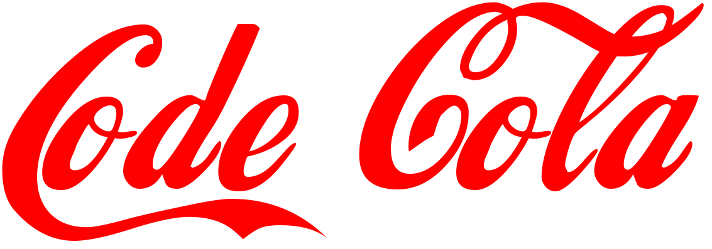

<h1 align="center">
   
</h1>
<p align="center">
  
  
  
</p>
<div align="center">
  <h3>
    <strong>Transform Java code into step-by-step drink recipes</strong>
  </h3>
  <h4>
    <em>Creative • Visual • Beginner-friendly</em>
  </h4>
</div>
<p align="center">
  <a href="#-features"><b>✨ Features</b></a> •
  <a href="#-example"><b>📸 Example</b></a> •
  <a href="#-getting-started"><b>🚀 Getting Started</b></a> •
  <a href="#-built-in-examples"><b>📂 Examples</b></a> •
  <a href="#-supported-java-syntax"><b>🧭 Syntax</b></a>
</p>
<hr>
<!---->

## 💡 About CodeCola
CodeCola is a creative Java project that transforms basic Java code snippets into step-by-step drink recipes. It's especially designed for beginners or anyone who enjoys a more visual and playful interpretation of programming logic.

> ☕ Perfect for making programming concepts more digestible and fun!

<hr>

## ✨ Features
<table>
  <tr>
    <td width="200"><h3 align="center">🔄</h3><h3 align="center"><b>Code-to-Recipe</b></h3></td>
    <td>Transforms Java logic into recipe steps</td>
  </tr>
  <tr>
    <td width="200"><h3 align="center">🎨</h3><h3 align="center"><b>Modern GUI</b></h3></td>
    <td>Minimalistic interface with flat design</td>
  </tr>
  <tr>
    <td width="200"><h3 align="center">📦</h3><h3 align="center"><b>Full Support</b></h3></td>
    <td>Variables, methods, loops, and conditions</td>
  </tr>
  <tr>
    <td width="200"><h3 align="center">🧠</h3><h3 align="center"><b>Smart Units</b></h3></td>
    <td>Auto-detects ml, g, °C and other units</td>
  </tr>
  <tr>
    <td width="200"><h3 align="center">☕</h3><h3 align="center"><b>Built-in Examples</b></h3></td>
    <td>Cola, Cocktail, Coffee recipes included</td>
  </tr>
</table>

<hr>

## 📸 Example
### Java Input
```java
int water = 200;
int sugar = 50;
String flavor = "lime";
boolean carbonated = true;
boil(water);
add(sugar);
addFlavor(flavor);
if (carbonated) {
    mix();
}
serve();
```

### Recipe Output
```yaml
Prepare 200 ml water  
Prepare 50 g sugar  
Select "lime" as flavor  
Set carbonated to on  
Heat 200 ml  
Add 50 g  
Add lime  
If carbonated, then:  
Mix everything  
Serve everything
```

<hr>

## 🚀 Getting Started
### Requirements
- Java 17 or newer
- Any IDE (IntelliJ, Eclipse) or terminal with javac and java

### Run
```bash
javac CodeColaGUI.java
java CodeColaGUI
```

<hr>

## 📂 Built-in Examples
Choose from several sample "recipes":
- **Simple Example** – A basic drink with sugar and flavor
- **Advanced Cola** – With temperature, caramel, and stirring
- **Cocktail Recipe** – Includes lime, rum, and garnish
- **Coffee Preparation** – Classic coffee with optional plant milk

<hr>

## 🧭 Supported Java Syntax
<table>
  <tr>
    <td width="200"><h3 align="center">🔤</h3><h3 align="center"><b>Primitive Types</b></h3></td>
    <td><code>int</code>, <code>double</code>, <code>String</code>, <code>boolean</code></td>
  </tr>
  <tr>
    <td width="200"><h3 align="center">⚙️</h3><h3 align="center"><b>Method Calls</b></h3></td>
    <td><code>boil(...)</code>, <code>add(...)</code>, <code>serve()</code>, etc.</td>
  </tr>
  <tr>
    <td width="200"><h3 align="center">🔀</h3><h3 align="center"><b>Control Structures</b></h3></td>
    <td><code>if</code>, <code>for</code>, <code>while</code></td>
  </tr>
  <tr>
    <td width="200"><h3 align="center">🏗️</h3><h3 align="center"><b>Definitions</b></h3></td>
    <td>Class and method definitions for recipe steps</td>
  </tr>
</table>

<hr>

## ❓ Help
Press **F1** or click the **?** icon in the app for help with syntax, examples, and tips.

<div align="center">
  <p><i>© 2025 CodeCola Project</i></p>
</div>
